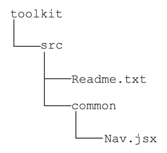
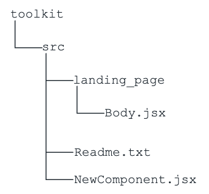

This page explains how the developers can plug in the required toolkit code and customize the Consent Manager Portal by modifying or adding files.

!!! info
    This is only available as a WSO2 Update from **WSO2 Open Banking Identity Server Accelerator Level
    3.0.0.77** onwards. For more information on updating,
    see [Getting WSO2 Updates](../install-and-setup/setting-up-servers.md#getting-wso2-updates).

After setting up the required toolkit, the default Consent Manager application is overridden by the Consent Manager 
application specific to each toolkit. Follow the instructions below to customize the application furthermore.

## Setting up the Consent Manager source code for advanced customizations

!!! info
    The source code of the Consent Manager application is available in the `<IS_HOME>/repository/deployment/server/webapps/consentmgr/self-care-portal-frontend` directory. 
     
Follow the instructions below to set up the source code for Consent Manager for advanced customizations.

1. Open a terminal.

2. Navigate to the `<IS_HOME>/repository/deployment/server/webapps/consentmgr/self-care-portal-frontend` directory.

3. Run the following command to install the dependencies required for the React project:

    ```
    npm install
    ```

4. Open the `<IS_HOME>/repository/deployment/server/webapps/consentmgr/self-care-portal-frontend` folder in your IDE.

    !!! note
        If the `<IS_HOME>/repository/deployment/server/webapps/consentmgr/self-care-portal-frontend` directory does not contain the `toolkit/src` pathway, create it.

5. You can modify the existing components and/or add new components according to your requirements. Refer to the relevant section below for the instructions.

## Modifying existing components in the Consent Manager application

- Any file inside the `<IS_HOME>/repository/deployment/server/webapps/consentmgr/self-care-portal-frontend/toolkit/src` folder can override the original file at the `<IS_HOME>/repository/deployment/server/webapps/consentmgr/self-care-portal-frontend/accelerator/src` folder.

- For example, the `self-care-portal-frontend/toolkit/src/common/Nav.jsx` file takes precedence over the `self-care-portal-frontend/accelerator/src/common/Nav.jsx` file when the npm build is running.

    !!!note
        The name of the file and the location relative to the source folder needs to be identical.

A sample structure of the `<IS_HOME>/repository/deployment/server/webapps/consentmgr/self-care-portal-frontend/toolkit/src` folder is shown below:
  


!!! warning "Important"

    The file extension is mandatory for any imports added. For example,

    ```
    import { logout } from “../login/logout.js”;
    ```

    Here, the `.js` extension is compulsory. Otherwise, the webpack throws an error.

Follow the steps below to modify an existing component:

1. Copy the file you want to modify.

2. Create an identical path in the `<IS_HOME>/repository/deployment/server/webapps/consentmgr/self-care-portal-frontend/toolkit/src` folder.

3. Modify according to your requirements.

4. Navigate to the `<IS_HOME>/repository/deployment/server/webapps/consentmgr/self-care-portal-frontend` directory in a terminal.

5. Run the following command.

    ```
    npm run build
    ```

    !!! tip
        If the changes are not visible in the Consent Manager application, restarting the Identity Server will reflect the changes.

**Try Out Example 01**

1. Copy the `<IS_HOME>/repository/deployment/server/webapps/consentmgr/self-care-portal-frontend/accelerator/src/common/Nav.jsx` file.

2. Open the `<IS_HOME>/repository/deployment/server/webapps/consentmgr/self-care-portal-frontend/toolkit/src` directory.

3. Create a folder named `common` there if it does not already exist.

4. Paste the `Nav.jsx` file in the `<IS_HOME>/repository/deployment/server/webapps/consentmgr/self-care-portal-frontend/toolkit/src/common` directory.

5. Edit the `Nav.jsx` in the above location.

6. Navigate to the `<IS_HOME>/repository/deployment/server/webapps/consentmgr/self-care-portal-frontend` directory in a terminal.

7. Run the following command:

    ```
    npm run build
    ```

## Adding new components in the Consent Manager application

You can add your own files to customize the UI in the `<IS_HOME>/repository/deployment/server/webapps/consentmgr/self-care-portal-frontend/toolkit/src` folder.

For example, you can import the `NewComponent.jsx` file by adding the `AppOverride` prefix to the import and providing the full path relative to the toolkit folder.			

```
import { NewComponent } from 'AppOverride/src/NewComponent.jsx';
```

If you try to import the `NewComponent.jsx` file without adding the `AppOverride` prefix as follows, a bundler error will be thrown.					

```
import { NewComponent } from '../NewComponent.jsx';
```

!!! warning "Important"

    The file extension is mandatory for the imports added. For example,

    ```
    import { NewComponent } from ‘AppOverride/src/common/NewComponent.jsx’;
    ```
    
    Here, the `.jsx` extension is compulsory. Otherwise, the webpack throws an error.

A sample structure of the `<IS_HOME>/repository/deployment/server/webapps/consentmgr/self-care-portal-frontend/toolkit/src` folder is shown below after adding the `NewComponent.jsx` file:



Follow the steps below to add a new component:

1. Create a new file in the desired location inside the  `<IS_HOME>/repository/deployment/server/webapps/consentmgr/self-care-portal-frontend/toolkit/src` folder.

2. Add the import to the desired file. Follow the above-mentioned instructions when adding the `import` statements.
Adding imports to an existing component modifies that file. Follow the [Modifying existing components in the Consent Manager application](#modifying-existing-components-in-the-consent-manager-application) section for more details.

3. Navigate to the `<IS_HOME>/repository/deployment/server/webapps/consentmgr/self-care-portal-frontend` directory in a terminal.

4. Run the following command.

    ```
    npm run build
    ```

    !!! tip
        If the changes are not visible in the Consent Manager application, restarting the Identity Server will reflect the changes.

**Try Out Example 02**

1. Open the `<IS_HOME>/repository/deployment/server/webapps/consentmgr/self-care-portal-frontend/toolkit/src` directory.

2. Create a new file named `NewComponent.jsx` there.

3. Add the necessary code for the React component.

4. Open the `<IS_HOME>/repository/deployment/server/webapps/consentmgr/self-care-portal-frontend/accelerator/src/landing_page` directory.

5. Copy the `Body.jsx` file.

6. Create a similar path in the  `<IS_HOME>/repository/deployment/server/webapps/consentmgr/self-care-portal-frontend/toolkit/src` directory.

7. Paste the `Body.jsx` file there.

8. Add the following import to the `<IS_HOME>/repository/deployment/server/webapps/consentmgr/self-care-portal-frontend/toolkit/src/landing_page/Body.jsx` file and use the component as needed.

    ```
    import { NewComponent } from 'AppOverride/src/NewComponent.jsx';
    ```

9. Navigate to the `<IS_HOME>/repository/deployment/server/webapps/consentmgr/self-care-portal-frontend` directory in a terminal.

10. Run the following command.

    ```
    npm run build
    ```

### Importing an existing Accelerator component to the newly added component

Consider the following example. `NewPage.jsx` is a newly added component to the toolkit. You want to import the `Nav.jsx` file of the Accelerator into it.


You can import an existing Accelerator component as follows:

```
import { Nav.jsx } from '../../accelerator/src/common/Nav.jsx';
```