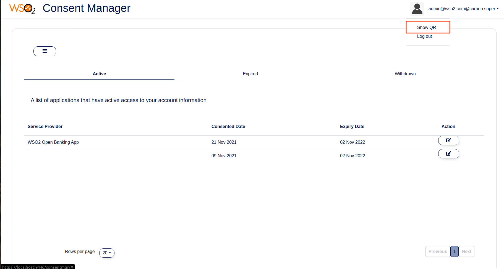
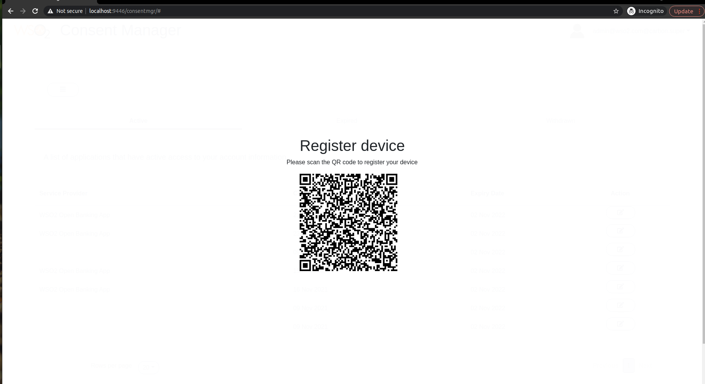
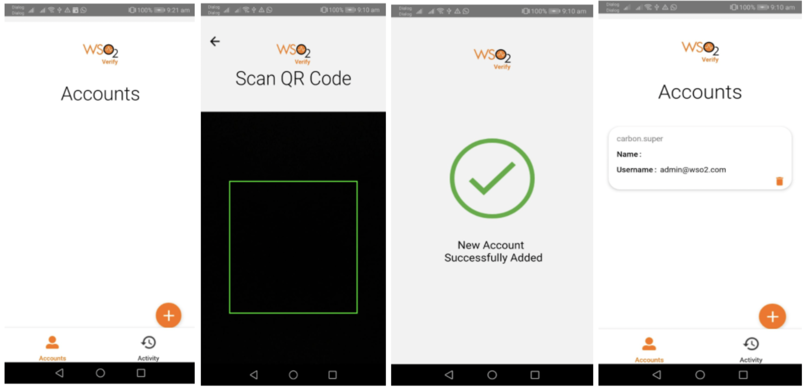
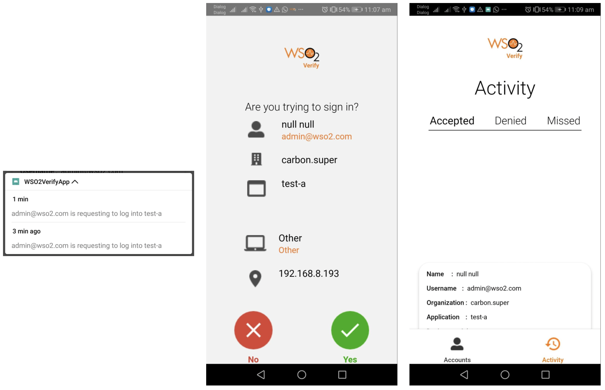

# Try out CIBA with a sample mobile application

The CIBA flow requires a mobile application to interact with the end-user (bank customer) for backchannel authentication. 
Ideally, this application should be implemented by the bank. If you wish to develop this application with React Native, 
an SDK is already available [here](https://github.com/wso2-extensions/identity-outbound-auth-push/blob/master/sdk/README.md).
Several essential requests related to the Identity Server are facilitated via this SDK. 

WSO2 Identity Server provides a sample React Native application and this section explains how to set it up for a CIBA flow.

!!! note
    The available sample application is not implemented with a focus on CIBA but can be customized to try out a CIBA flow 
    as instructed below.

## Set up React Native mobile application

1. Clone the [ciba-sample-app](https://github.com/KalanaDananjaya/ciba-sample-app) GitHub repository.
2. A React Native project is available in the following path: 
    ```
    /WSO2VerifyApp
    ```
3. Upgrade Node.js and npm to the latest versions.
4. Enable USB debugging in your device and set up your Linux machine.
5. Go to the [React Native documentation](https://reactnative.dev/docs/running-on-device#running-your-app-on-android-devices)
   and follow steps 1 and 2.

    - In addition to the above, install adb:
    
        ```shell
        sudo apt install adb
        ```
     
6. Setup Android SDK:
   
    - If you have installed Android Studio, you have already set up the Android SDK. 
    - Edit the `.bashrc` file and set the environment variables as follows:
       ```shell
       sudo gedit ~/.bashrc
       ```
    - According to your installation, add the following content before `export PATH` and save:
      ```shell
      ANDROID_SDK_ROOT="/home/user/Android/Sdk"
      PATH=$PATH:$ANDROID_SDK_ROOT/tools
      PATH=$PATH:$ANDROID_SDK_ROOT/platform-tools
      PATH=$PATH:$ANDROID_SDK_ROOT/build-tools/31.0.0
      export ANDROID_SDK_ROOT
      ```
    
7. Install React Native CLI:

    ```shell
    sudo npm install -g react-native-cli
    ```
   
## Modify the existing application

1. Create an FCM project at [Firebase Console](https://console.firebase.google.com/) and create an Android application under that. You can use your own 
project and package names. When configuring the [Push Authenticator IDP](ciba-set-up-flow.md#configuring-push-authenticator-idp), use the
**Server Key** of this project.

    For example:
       Project name: `wso2-verify` <br/>
       Package name: `com.wso2verifyapp` <br/>

    - Download the `google-service.json` file from your project and replace the existing file
    of the WSO2 application (`/WSO2VerifyApp/android/app/google-services.json`).

2. If you run the application now, you will get the following error:

    ```shell
    '@wso2/auth-push-react-native' module is not in the npm registry.
    ```

       - To fix this issue, build the SDK manually and add it to the project. This happens because the Identity Server 
         has not yet pushed their SDK to the npm registry.

3. Clone the [identity-outbound-auth-push](https://github.com/wso2-extensions/identity-outbound-auth-push/tree/master) GitHub
   repository.
4. Go to the location where you cloned the `identity-outbound-auth-push` repository.

       - Open a terminal from the `/identity-outbound-auth-push/sdk/package` directory.
       - Execute the following:
   
         ```shell
         npm install
         ```

         ```shell
         npm run build
         ```

5. Create a new directory named `packages` in the app project root directory (`/WSO2VerifyApp`).

6. Create a new directory named `auth-push-react-native` inside the `packages` directory and the copy the above package
   content to this new directory. 

    !!! tip
        You may remove the `src` directory as it is not required once the SDK is built.

7. Open a terminal from `/WSO2VerifyApp/packages` and run:

    ```shell
    npm install package
    ```

8. Even though you run the mobile app, it won’t communicate with the Identity Server until the following changes
are performed. They will enable communication between the React Native app and the Identity Server.

    - Update the `/WSO2VerifyApp/android/app/src/main/res/xml/network_security_config.xml` file with your 
      Identity Server's IP address.

        ``` 
        <domain includeSubdomains="true">192.168.8.193</domain>
        ```
      
    - Copy the public cert (`wso2carbon.pem`) extracted from the new keystore of the Identity Server to the  
      `/WSO2VerifyApp/android/app/src/main/res/raw` directory.
    
## Run React Native app in an Android device

1. Run the React Native app on the mobile device in debug mode. For instructions, follow 
[React Native documentation](https://reactnative.dev/docs/environment-setup).

    - Go to the project root directory at `/ciba-sample-app/WSO2VerifyApp` and run:
   
        ``` 
        npm install
        ```

    - Run the command below to build and run the app (both metro bundler and app will start):

        ``` 
        npx react-native start && react-native run-android
        ```

2. If the build is successful, but an error is generated when the app is loading, indicating that the file watchers are 
limited:

      ```
      echo fs.inotify.max_user_watches=524288 | sudo tee -a /etc/sysctl.conf && sudo sysctl -p
      ```

      ``` 
      cat /proc/sys/fs/inotify/max_user_watches
      ```

      Issue the above commands and rerun the app.


## Device registration flow with the mobile app

!!! note
    To try out this example, connect both Identity Server and the mobile phone to the same network.

1. Get the QR code to scan and register your app. The bank will invoke the following endpoint in the Identity Server
   with basic authentication.

    ``` tab="Request"
    GET : https://192.168.8.193:9446/api/openbaking/ciba/push-auth/discovery-data
    Headers - Authorization : basic <Base 64 encoded admin credentials>
    ```
   
    ``` tab="Response"
    {
       "did":"014e502a-cdff-43bd-9705-ad0ceb6dd351",
       "un":"admin@wso2.com",
       "td":"carbon.super",
       "hst":"https://192.168.8.193:9446",
       "bp":"/t/carbon.super/api/users/v1/me",
       "re":"/push-auth/devices",
       "ae":"/push-auth/authenticate",
       "rde":"/push-auth/devices/remove",
       "chg":"82e33587-ba35-440e-8f73-d3542a859da8"
    }
    ```

    Use a QR code generator and add this JSON discovery response as the content of the QR code.

    ??? tip "Click here to see a sample implementation of the above functionality in Open Banking Consent Manager Portal"
        You can try out this without generating a QR code by yourself.
      
          
          

2. Use the mobile app and register it as a device by scanning the QR code. The app is connected to the configured
Google FCM project (a firebase Android cloud project) during the installation. An FCM token is generated inside the 
device as a unique identifier and registered with the Firebase cloud project as well.

    !!! note
        The generated FCM token needs to be used as the **pushId** when registering the device with WSO2 Identity Server.

3. Open the mobile app, click the (+) button to scan the QR code and register your device in the Identity Server.

    

The registration request body contains the following:

   

  - JSON content extracted from the QR code
  - FCM token of the device (`pushId`)
  - Public key for the device
  - Device information

## Try out CIBA flow

1. Send the CIBA authentication request to the Identity Server. Then you will receive a notification on your mobile 
device.

2. Once opened, the notification is displayed as a message and asks for approval.

      

      - The notification message contains the following:
   
         

   1. When the approval button is clicked the following request is sent to the Identity Server as the response that the user 
   has approved.

      

      - The response is signed with the private key of the device. The private key is generated during the device registration.
      The Identity Server can decode the response as the public key is stored in the `PUSH_AUTHENTICATION_DEVICE` database 
      table.
   
      - The decoded format of the signed JWT is as follows:
      
         ``` json
         {
            "jti":"217754ec-1df0-47f1-8437-f074ebcd14c2",
            "sub":"admin@ws02.com@carbon.super",
            "iss":"wso2verify",
            "aud":"https://192.168.8.193:9446/t/carbon.super/",
            "nbf":1628103736,
            "exp":1628107336,
            "iat":1628103736,
            "sid":"398ec5fd-4f3-4b42-a282-6f1c79981063",
            "chg":"fe1091fa-b4a5-44bb-993d-7426028a51f5",
            "res":"SUCCESSFUL"
         }
         ```


