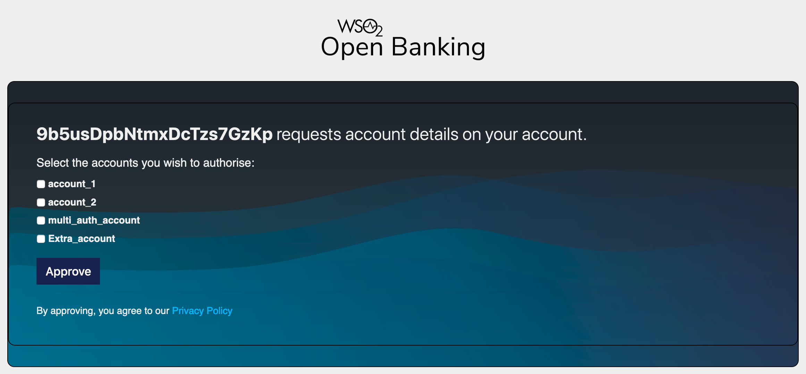

During the consent authorization process, the banks redirect customers to provide consent for API consumers to access 
their banking information. The process is as follows:

1. API consumer requests to access the banking information of a customer.
2. Bank validates the API consumer’s request.
3. The bank redirects the requested information (containing the information the API consumer application wants to access)
to the customer.
4. The bank authenticates the customer. See below for the default login page of the consent page:
 
    
    
5. A list of bank accounts and the information that the API consumer wishes to access are displayed.
      
    
6. The customer can view the information before consenting or denying it. For example,
     
 
##Consent Authorization in WSO2 Open Banking Accelerator

Following components perform the consent authorization:

###Authorization endpoint
Before the API consumer application accesses the customer's banking information, the API consumer sends an authorization 
request to get the customer's consent for it. The authorization request contains a request object. This request object is 
a self-contained JWT, which helps banks to validate the API consumer.

The method of sending the authorization request can vary as follows:

- **Send the authorization details in the authorization URL**

The API consumers share the request object containing the authorization details to the authorization server and obtain the 
authorization URL.

- **Send the authorization details as a reference in the authorization URL**

The API consumers push authorization details directly to the authorization server and obtain a reference. This method is also 
known as **Pushed Authorization**. The reference is notated by the claim; `request_uri`. Thereby, it prevents:
                                                                                         
- Intruders from intercepting the authorization information sent in the request_object
- Authorization request calls becoming bulky with the authorization details signed in the JWT

and protects the confidentiality and integrity of the authorization details when passing through an API consumer application.

###Pushed Authorization web application
The API consumers obtain `request_uri` which is a reference to the authentication and authorization details sent in the 
pushed authorization request.

- **Pushed Authorization - /par endpoint**

Upon successful invocation of the `/par` endpoint, API consumers will receive a ‘request_uri’ value with an expiration time. Therefore, the reference is only valid until the expiration time for the subsequent authorization invocation.

Given below is a successful response:

```
{
    "request_uri": "urn:ietf:params:oauth:request_uri:bwc4JK-ESC0w8acc191e-Y1LTC2",
    "expires_in": 60
}
```

This same `request_uri` value is used in the subsequent authorization request as well.

WSO2 Open Banking Accelerator allows you to perform custom validations for the pushed authorization request. 
For more information, refer [writing a Custom Pushed Auth Request Validator.](https://openbanking.atlassian.net/wiki/spaces/DZ/pages/252018873/OB+Root+and+Issuing+Certificates+for+Sandbox)

??? tip "Click here to see the configurations related to Pushed Authorization web application..."
    Open the `<IS_HOME>/repository/conf/deployment.toml` file. Add the following configurations that allow you to change the format, and the expiration time of the `request_uri` reference:
    
    ```
    [open_banking.push_authorisation]
    expiry_time=60
    request_uri_sub_string="substring"
    ```

    !!! note
        You can change the format of the request_uri using the request_uri_sub_string tag.
        
        ```
        {
            "request_uri": "urn:<substring>:bwc4JK-ESC0w8acc191e-Y1LTC2",
            "expires_in": 60
        }
        ```

###Authorization web application 
The API consumers obtain an authorization URL that redirects the customer to a web interface hosted by the bank. In this 
web application, the customer:

- Logs in using the login credentials. 
- Views information that the API consumer requested to access.
- Selects the accounts that the API consumer can access.
- Provides consent to the API consumer to access the information.

###Identifier-first authenticator
Banks use Identifier-first authentication to authenticate the user with a second-factor authenticator instead of a password. 
The user who logs into the authorization web application, can provide the username, and authenticate using a second-factor 
authentication mechanism such as SMS-OTP/TOTP. 
