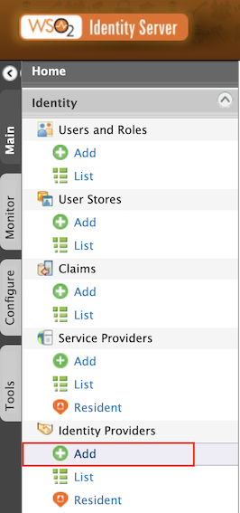
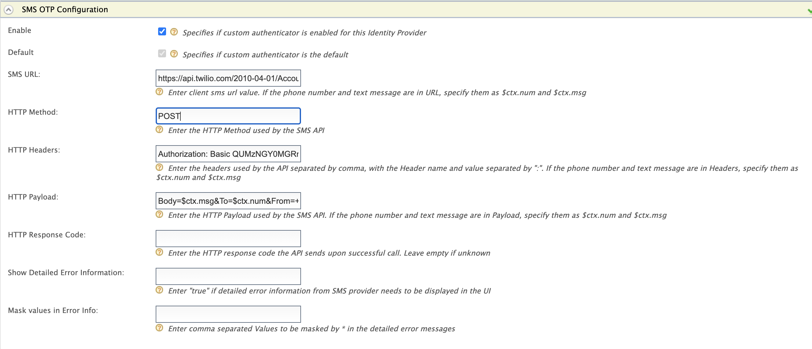
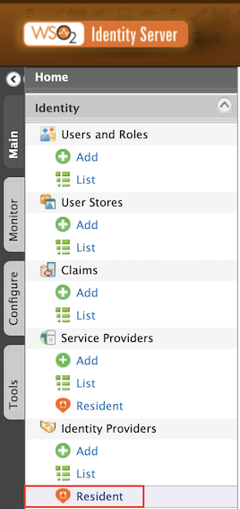
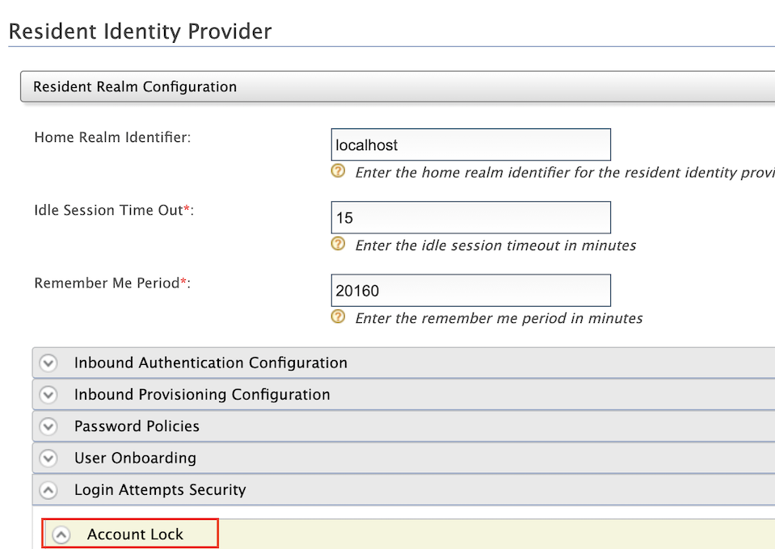
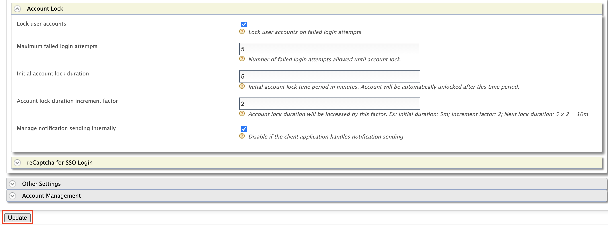
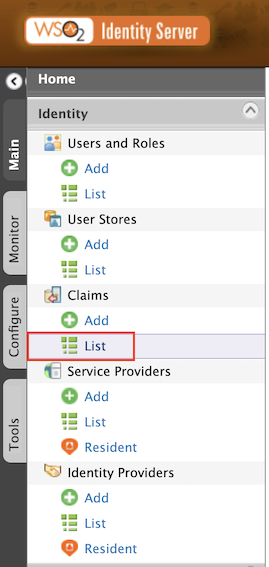
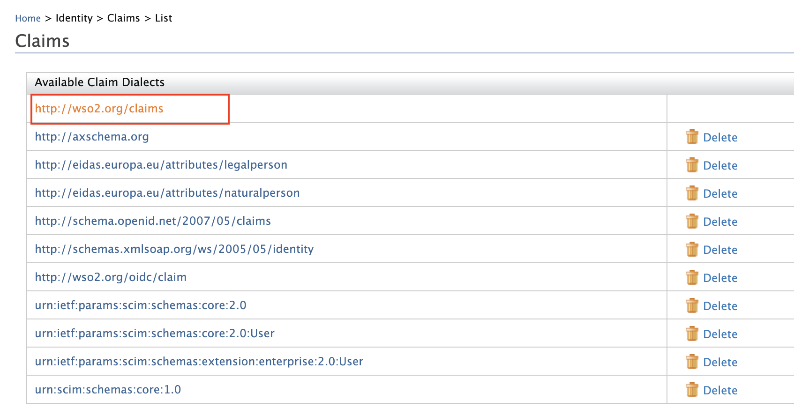
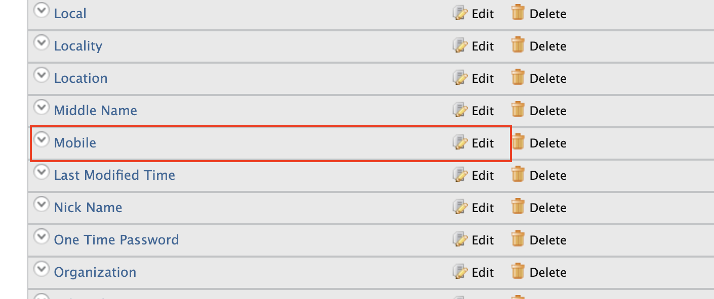
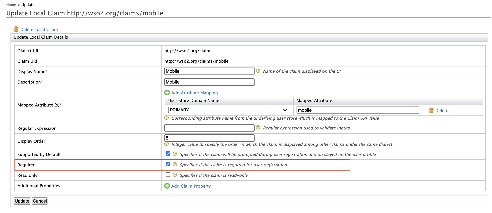

**Identifier-first authentication** allows identifying the individuals prior to authenticating them. It retrieves the identity 
of the user without using authentication information and uses that identity to control the authentication flow.

You can implement identifier-first authentication using a custom local authenticator. For more information, see [Identifier-first Flow Handler](https://is.docs.wso2.com/en/latest/learn/identifier-first-flow-handler/#configuring-identifier-first-handler-in-the-login-flow).
WSO2 Open Banking consists of an identifier-first authenticator by default. You can configure it in two ways:

- Before server start
- After server start

###Before server start
If you have not started the Identity Server and API Manager servers, follow the below instructions to configure 
identifier-first authentication.

1. Locate the following configuration in  `<IS_HOME>/repository/conf/deployment.toml` and Update the value of the `parameters.authRequestURL`  
configuration with the host name of the Identity Server:
``` toml
[[authentication.custom_authenticator]]
name = "IdentifierExecutor"
parameters.ValidateUsername = true
parameters.throttleLimit = 3
parameters.throttleTimePeriod = 300
parameters.authRequestURL = "https://<IS_HOST>:9446/api/identity/auth/v1.1/data/AuthRequestKey/"

[authentication.authenticator.sms_otp.parameters]
EnableAccountLockingForFailedAttempts = true
BackupCode = false
TokenExpiryTime = 6
```

2. Add the following configuration in `<IS_HOME>/repository/conf/deployment.toml` to make the default identifier-first 
authenticator the primary authenticator:
``` toml
[open_banking.sca.primaryauth]
name = "IdentifierExecutor"
display = "ob-identifier-first"
```

3. Update the `<IS_HOME>/repository/conf/common.auth.script.js` file with the following steps:
```
var psuChannel = 'Online Banking';

function onLoginRequest(context) {
	publishAuthData(context, "AuthenticationAttempted", {'psuChannel': psuChannel});
	doLogin(context);
}

var doLogin = function(context) {
	executeStep(1, {
    	onSuccess: function (context) {
        	//identifier-first success
    	Log.info("Authentication Successful");
        	publishAuthData(context, "AuthenticationSuccessful", {'psuChannel': psuChannel});
        	OTPFlow(context);
    	},
    	onFail: function (context) { //identifier-first fail
    	Log.info("Authentication Failed");
        	publishAuthData(context, "AuthenticationFailed", {'psuChannel': psuChannel});
        	doLogin(context);
    	}
	});
};

var OTPFlow = function(context) {
	executeStep(2, {
   			 //OTP-authentication
    	onSuccess: function (context) {
        	context.selectedAcr = "urn:cds.au:cdr:2";
        	publishAuthData(context, "AuthenticationSuccessful", {'psuChannel': psuChannel});
    	},
    	onFail: function (context) {
        	publishAuthData(context, "AuthenticationFailed", {'psuChannel': psuChannel});
        	OTPFlow(context);
    	}
	});
};
```

###After server start
If you have already started the Identity Server and API Manager servers, follow the below instructions to configure 
identifier-first authentication.

####Configuring SMS OTP authenticator
1. Sign in to WSO2 Identity Server Management Console at `https://<IS_HOST>:9446/carbon`.
2. On the **Main** tab, click **Home > Identity > Identity Providers > Add**. 
3. Give `Identity Provider Name` as `SMSAuthentication`. 
4. Expand **Federated Authenticators > SMS OTP Configuration**.
5. Select both the **Enable** and **Default** checkboxes. This is to enable and make the `SMSAuthentication` authenticator 
the default one. Based on your SMS provider, fill out the SMS OTP configurations.

    !!!note
        Currently, the WSO2 Identity Server supports only the following SMS providers.
            
           - Twilio
           - Nexmo
           - Clickatell
           - Plivo
           - Bulksms
    
    !!!tip "If Twilio is used as the SMS provider,"
        1. Go to [https://www.twilio.com/try-twilio](https://www.twilio.com/try-twilio) and create an account.
        2. While registering the account, verify your mobile number and click on console home [https://www.twilio.com/console](https://www.twilio.com/console) 
        to get free credits (Account SID and Auth Token).
        3. Twilio uses a POST method with headers and the text message and phone number are sent as the payload. So the 
        fields would be as follows:
        
        <table>
               <tbody>
                  <tr>
                     <th>SMS URL</th>
                     <td>`https://api.twilio.com/2010-04-01/Accounts/%7BAccountSID%7D/SMS/Messages.json`</td>
                  </tr>
                  <tr>
                     <th>HTTP Method</th>
                     <td>`POST`</td>
                  </tr>
                  <tr>
                     <th>HTTP Headers</th>
                     <td>`Authorization: Basic base64{AccountSID:AuthToken}`</td>
                  </tr>
                  <tr>
                     <th>HTTP Payload</th>
                     <td>`Body=$ctx.msg&To=$ctx.num&From=urlencode{TrialNumber}`</td>
                  </tr>
               </tbody>
            </table>
            
        !!!note
            If you pass the text message and the phone number in any field, you have to replace them with `$ctx.num` and 
            `$ctx.msg` respectively. For example, `Body=$ctx.msg&To=$ctx.num&From=+12345678`.
        
        
        
6. Click **Register** to add the Identity Provider. 

####Configure account locking
1. On the **Main** tab, click **Home > Identity > Identity Providers > Resident**. 
2. Expand **Login Attempts Security > Account Lock**. 
3. Select **Lock user accounts** and click **Update**. 

####Configure mobile as a mandatory claim
1. On the **Main** tab, click **Home > Identity > Claims > List**. 

    

2. Select  `http://wso2.org/claims` from the list. 
3. Locate **Mobile** from the list and select **Edit**. 
4. Select **Required** and click **Update**. 

!!!note
     By default account locking for failed SMS-OTP attempts is enabled. The number of SMS-OTP attempts is set to 5. Once 
     the number of SMS-OTP attempts have been tried and failed, the user account will be locked.
     
     You can cancel authentication flow by not continuing. The following message box will pop up to get user consent to continue 
     or cancel as follows: 
