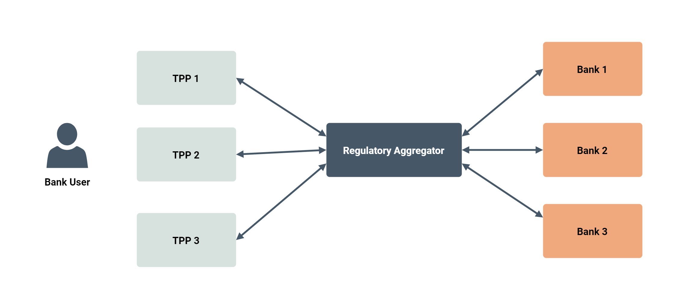

#Regulatory Aggregator

A regulatory entity enforces regulations for open banking and open finance in a country or 
a region. For example, ACCC in Australia and FCA in the UK. Apart from enforcing policies, some entities implement open 
banking in their country and provide services to financial institutions and third-party apps. In addition, some 
regulatory bodies are placing themselves as the central gateway for open banking APIs. This allows third-party apps to 
connect with this gateway of regulatory aggregators instead of registering with each financial institution individually. 
This type of aggregator is known as a Regulatory Aggregator.

In simple terms, a regulatory aggregator is an authoritative entity in a region that acts as the sole open banking 
interface and the gateway for all open banking services provided by financial institutions in that particular area.

### Regulatory Aggregator Ecosystem 

The Regulatory Aggregator is the gateway for all the API calls instead of just being the validator.  In this ecosystem, 
all third-party applications are only registered with the regulatory aggregator, and all the API calls, including token 
and authorization calls, are done via the regulatory aggregator.  They are connected to all financial institutions via 
a secure channel and therefore, the financial institutes trust the regulatory aggregator. 

### WSO2 Open Banking Accelerator and Regulatory Aggregator

WSO2 Open Banking Accelerators are implemented to cater to a variety of open banking regulatory requirements in 
financial institutions. A Regulatory Aggregator is expected to handle consent management, third-party onboarding, 
federated user authentication, and regulatory reporting that are already included in the WSO2 Open Banking Accelerator. 
Therefore, a small toolkit is developed on top of the WSO2 Open Banking Accelerators to fulfil the Regulatory Aggregator 
requirements seamlessly. 